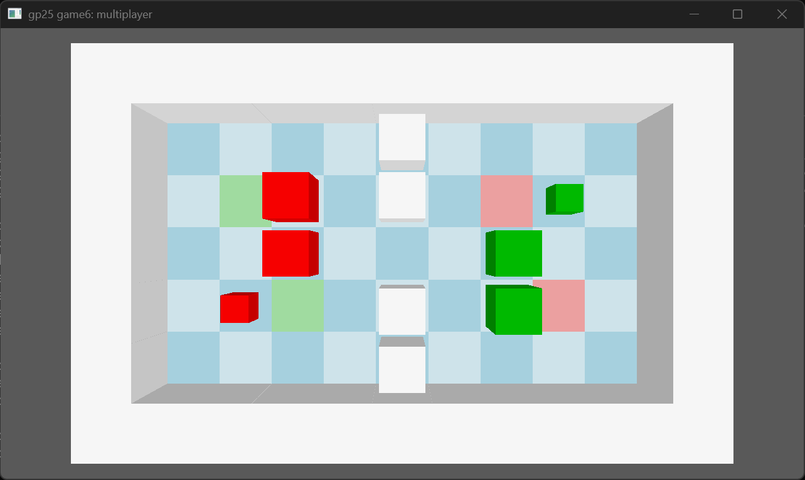

# SOCOOPBAN

Author: Tao Jin

Design: This is a coop sokoban (as suggested by its name) where players can only push boxes that has the same color to their character. The goal is to fill up all the target grid with corresponding color boxes or the player character. I initially pictured this game to be competitive, but this makes the goal unclear and the input hard to sychronize (how to 'fairly' determine which player pushes a box first and show it to players in time), so I altered the design to be cooperative.

Networking: The server runs all the game logic and the clients only send inputs and draw. Clients send `C2S_Controls` (button presses) every frame; the server sends `S2C_State` (game state, board, players) to every client each tick. Only two players can join. Messages are in `Game.cpp`, the server loop in `server.cpp`, the client in `PlayMode.cpp`.

Screen Shot:

How To Play:

W A S D: move one grid per press. Space: restart the level.

Walk into boxes of your color to push them; white blocks and the other player's boxes can't be pushed. Clear the level by covering every light red grid with red boxes or player 1, and every light green grid with green boxes or player 2.

Sources: https://www.behance.net/gallery/229633373/UESC-Display-Font

This game was built with [NEST](NEST.md).
